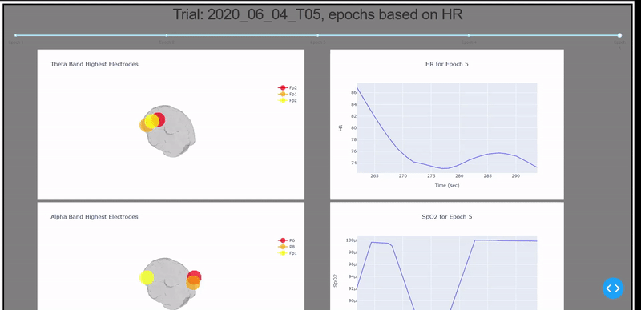

# interactiveADELE
Biometric project for F21 Senior Design Team

## Data Processing

### EEG Data
The EEG data consisted of 64 electrodes where each electrode had a specific voltage that was measured from the subject over time. The goal was to split that data into epochs and be able to show the EEG frequency bands of all the electrodes in each given epoch along with their respective time indices at which the data was split. To gain a better understanding of this EEG data the signal.welch function from the SciPy library was used on each electrode to convert the voltages to frequencies and collect the power spectral density. The frequencies were then matched to the corresponding EEG frequency bands of Delta, Theta, Alpha, Beta, and Gamma. Once a match was found the mean of the power spectral density for the electrode was taken to give the correct value for the given EEG frequency band. This process continued through each electrode where the end result was a dataframe consisting of all 64 electrodes and their respective frequency bands at each given epoch.

